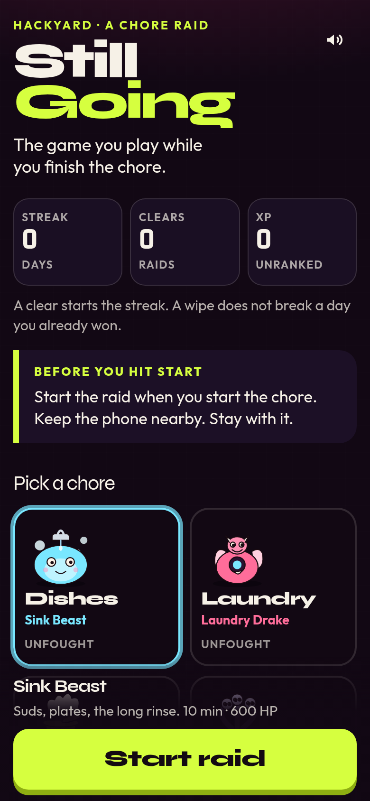

# Still Going

> Still Going is a boss fight that only dies if you actually finish the chore.

The game you play while you finish the chore. Pick the dishes, the laundry, the trash, the vacuum, the desk, the inbox, or a workout. The timer is the boss's HP. Stay with the task until the clock runs out.



## How this fits the Yard theme

HackYard Yard #4 is **Gamification**. The rule is that the game has to help you complete a real chore while you play, not just wear a chore costume.

Still Going is the timer and the accountability:

- You start the raid when you start the chore, with the phone nearby.
- Boss HP is the clock. It only hits zero if you last the full duration.
- Every 40–50 seconds the phone asks **"Still going?"** Tap, hold, or swipe. That check only makes sense if you are actually there.
- Miss two checks in a row, or leave the screen for 12 seconds, and the raid wipes. Soft landing, no lecture.
- Last the whole timer and the boss goes down, because the chore did. You get XP, a day streak, and a clear card you can save as a PNG.

No account. No backend. Progress lives in `localStorage` on the phone you were holding.

## Play

1. Pick a chore and a duration (5, 10, 15, or 25 minutes).
2. Start the raid when your hands hit the task.
3. Answer the checks. Combo is how many you hit in a row.
4. Survive the clock. Save the card if you want to show the streak.

A wipe does not erase a day you already cleared. Clear again today and the streak holds.


### Rehearsal

A full raid is as long as the chore, which is a bad fit for a 60-second video. Add `?rehearsal=1` and a 5 minute selection plays in about 24 seconds. Checks come faster. Rehearsal clears celebrate and can still save a card, but they do not write your streak or XP.

## Run it

```bash
npm install
npm test
npm run dev
```

Production build, the folder Netlify should publish:

```bash
npm run build
npm run preview
```

`netlify.toml` builds with `npm run build` and publishes `dist/`. This repo does not deploy itself.

The app is static. After the first load, a small service worker caches the shell so a later offline open still runs. Sound is Web Audio beeps with a mute toggle. The screen tries to stay awake during a raid. `prefers-reduced-motion` turns off the looping motion and the confetti.

## Stack

Vite, React, TypeScript, Tailwind. Bosses are inline SVG. The clear card is drawn on a canvas. Fonts ship with the bundle.
