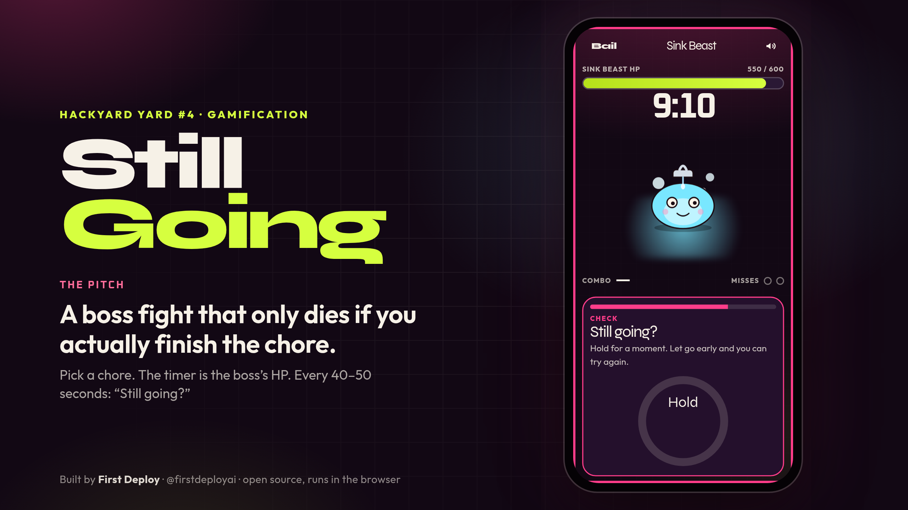
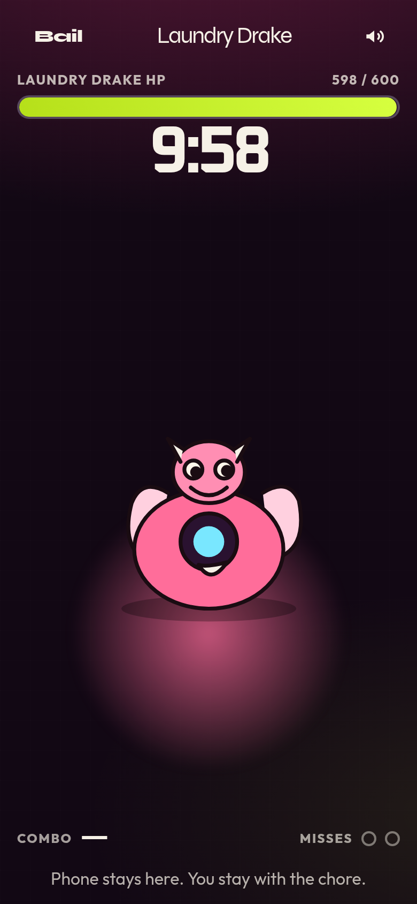
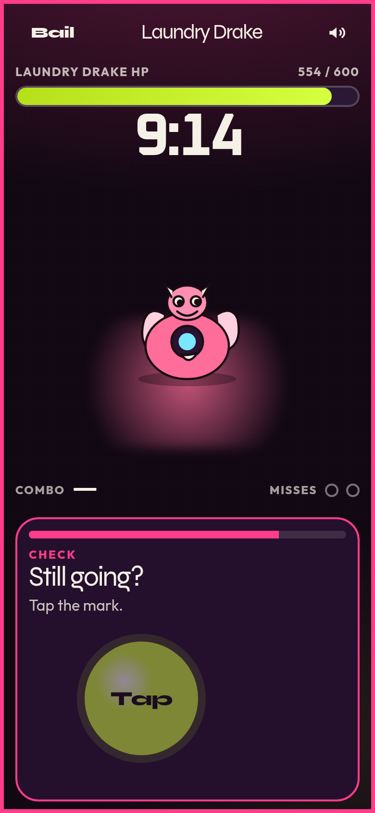
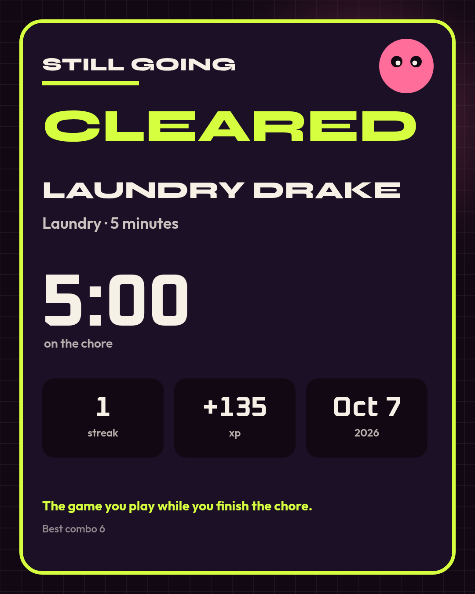

# Still Going

> **Still Going is a boss fight that only dies if you actually finish the chore.**

Pick a real chore — dishes, laundry, trash, vacuum, desk, inbox, or a workout — and start a raid when you start the task. The timer is the boss's HP. Every 40–50 seconds the phone asks **"Still going?"** Answer it and the fight goes on. Ignore it, or walk off with the phone, and the boss wins. Last the full clock and the boss goes down, because the chore did.



**Play it live:** https://stillgoing.netlify.app (add `?rehearsal=1` for a 24-second demo raid)

**Demo video (56s):** [`demo/still-going-demo.mp4`](demo/still-going-demo.mp4)

Built during **HackYard Yard #4** (theme: Gamification) by **First Deploy** ([@firstdeployai](https://x.com/firstdeployai)).

## Why it fits "turn a chore into a game that gets the chore done"

Most chore apps gamify the *checklist*: you tick a box and get points, whether or not you did the work. Still Going gamifies the *doing*:

- **The clock is the boss.** 5, 10, 15, or 25 minutes = 300, 600, 900, or 1,500 HP. The only way to drain it is to stay with the task.
- **Presence checks.** Every 40–50 seconds (jittered) a "Still going?" check pops up: tap the mark, hold for a beat, or swipe. It takes a second with wet hands and is impossible to answer from the couch in another room.
- **Real stakes, soft landing.** Miss two checks in a row, or leave the screen for 12 seconds, and the raid wipes. The wipe screen says how long you lasted and offers a retry. No guilt copy.
- **Rewards that mean something.** A clear gives XP, a daily streak, a best time per chore, and a clear card PNG you can save or share.

## How to play

1. **Pick a chore** and a duration. Each chore has its own boss: Sink Beast, Laundry Drake, Bin Wraith, Dust Hydra, Clutter Golem, Inbox Wyrm, Couch Titan.
2. **Start the raid when your hands hit the task.** Put the phone somewhere you can see it.
3. **Answer "Still going?"** Tap, hold, or swipe (arrow keys work on desktop). Every hit grows your combo.
4. **Survive the clock.** Boss down → confetti, XP, streak, and your clear card.
5. **Come back tomorrow.** One clear a day keeps the streak. A wipe never erases a day you already cleared.

Sound is short Web Audio cues (check alert, hit, miss, final stretch, clear, wipe) with a **mute toggle** in the top-right corner that remembers your choice. Phones that support it get a light vibration. The screen asks to stay awake during a raid, and `prefers-reduced-motion` turns off the looping motion and confetti.

## Screenshots

| Raid | "Still going?" check | Clear card |
| --- | --- | --- |
|  |  |  |

## Run it locally

Requires Node 20+.

```bash
npm install
npm test        # engine + profile tests
npm run dev     # http://localhost:5173
```

Production build:

```bash
npm run build   # outputs dist/
npm run preview
```

It's a static site: no account, no backend, no API keys. Progress (streak, XP, history, best times, mute) lives in `localStorage` on the device. A small service worker caches the shell after the first load.

### Rehearsal mode (for demos)

A real raid lasts as long as the chore. Add `?rehearsal=1` and a 5-minute raid plays in about 24 seconds with faster checks. Rehearsal clears are labeled **Practice**, and they don't write your streak or XP. See [`DEMO.md`](DEMO.md) for the shot list.

The demo video in `demo/` is a real 5-minute raid recorded in a browser at a phone viewport. Long stretches are sped up, and the speed is shown on screen.

## Stack

Vite, React 19, TypeScript, and Tailwind v4. Bosses are inline SVG, the clear card is drawn on a `<canvas>`, sound is synthesized with Web Audio, and fonts ship with the bundle (Syne, Outfit, Oxanium). There are no runtime services.

```
src/lib/engine.ts      raid state machine: clock, jittered checks, misses, wipe/clear
src/lib/profile.ts     streak, XP, history, best times (localStorage)
src/lib/clearCard.ts   canvas → PNG clear card
src/lib/audio.ts       Web Audio cues + mute
src/components/        Home, Raid, Challenge overlay, Result, BossArt
tests/                 node:test suites for the engine and profile
```

## Built during HackYard Yard #4

All code in this repo was written during HackYard Yard #4 build week (Oct 5–9, 2026) for the Gamification theme. Solo build by First Deploy ([@firstdeployai](https://x.com/firstdeployai)).

## License

MIT. See [LICENSE](LICENSE).
